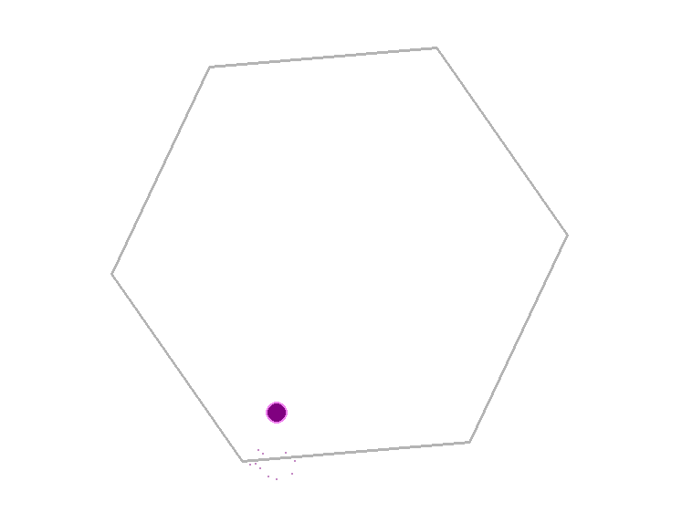

# Rotating Hexagon Bouncing Ball

A Pygame demo of a purple-violet ball falling under gravity inside a continuously rotating hexagon, with spark particles on every bounce.

---




## 🎨 Features

- **Gravity**  
  The ball accelerates downward, tracing natural parabolic arcs.

- **Elastic Collisions**  
  Perfectly bouncy impacts—no energy loss on contact.

- **Rotating Hexagon**  
  The six-sided boundary spins at a constant angular speed, changing bounce angles in real time.

- **Spark Particles**  
  Tiny, fading sparks emit from the contact point on each collision.

---

## ⚙️ Requirements

- 
- 


---

## 🚀 Installation & Setup

1. **Clone or download** this repository:
   ```bash
   git clone https://github.com/saideepaksana/bouncing_ball.git
   cd bouncing_ball


## License
Distributed under the MIT License. See [LICENSE](LICENSE) for details.